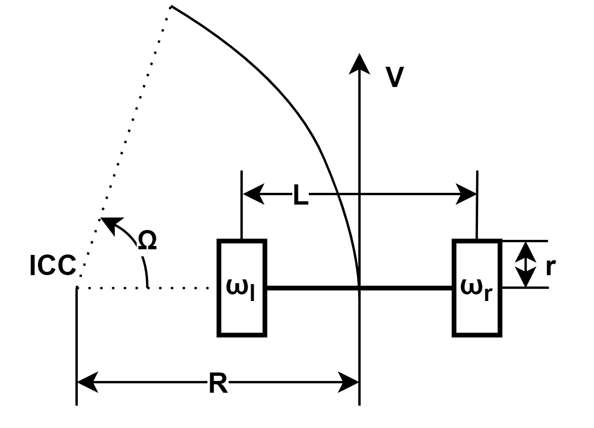

# Intro to ROS

Срок сдачи: 21 мая 2023, 23:59

Все вопросы, связанные с установкой/настройкой ROS - до 12 мая

## Установка Ubuntu + ROS

С помощью VirtualBox установить Ubuntu и ROS:
https://github.com/sutd-robotics/virtualbox-ubuntu-ros

**Поддержка общего буфера обмена**

- ПКМ по названию созданного образа в VirtualBox -> Settings -> General -> Advanced -> Shared
  Clipboard -> Biderectional

**Поддержка более высоких разрешений экрана, чем 800x600**

- В виртуальной машине запустить настройки через правый верхний угол -> Settings -> Devices ->
  Displays -> выбрать нужное разрешение -> Apply

  Прим.: Кнопка Apply находится в правом верхнем углу и может не помещаться на экран

**3D ускорение**

- Выключить виртуальную машину:
- ПКМ по названию образа в VirtualBox -> Settings -> Display -> Enable 3D Acceleration

## Настройка Catkin Workspace

В ROS для управления и сборки пользовательских пакетов используется утилита catkin. Скорее всего, вы уже настроили Workspace на шаге **Установка Ubuntu + ROS**, но более подробно про это написано в следующем туториале:
http://wiki.ros.org/catkin/Tutorials/create_a_workspace

## Задание А

Выполнить туториалы

1. http://wiki.ros.org/catkin/Tutorials/CreatingPackage
2. http://wiki.ros.org/ROS/Tutorials/WritingPublisherSubscriber(python)
3. http://wiki.ros.org/ROS/Tutorials/ExaminingPublisherSubscriber

## Задание Б

- Создать пакет, в состав которого входит один узел:

  - Узел для симуляции робота с дифференциальным приводом
    - Подписыватся на управляющие команды для линейной и угловой скоростей в формате geometry_msgs/Twist
    - Публикует показания энкодеров в пользовательском формате сообщений, содержащем поле типа std_msgs/Header и два uint32 поля для левого и правого
      энкодеров. В заголовок необходимо записывать текущее значение времени с помощью `rospy.Time.now()`. Создание и использование пользовательских сообщений описывается в туториалах:

      - http://wiki.ros.org/ROS/Tutorials/CreatingMsgAndSrv#Creating_a_msg
      - http://wiki.ros.org/ROS/Tutorials/CustomMessagePublisherSubscriber(python)
    - Публикует положение робота в формате `nav_msgs/Odom`

      Обратите внимание на поле `header.frame_id` - это название системы координат, в которой робот будет считать свое значение.
      Вы можете назвать ее любым именем, например, `odom`, но не забудьте использовать это имя, когда будете отрисовывать положение робота в `RViz`
    - Симуляцию робота с дифференциальным приводом можно осуществлять следующим образом:
      

      ```
      ICC - мгновенный центр скоростей 
      Ω - угловая скорость вращения центра робота вокруг МЦС 
      R - расстояние от МЦС до центра робота 
      L - расстояние между колесами 
      r - радиус колес 
      V - линейная скорость робота 
      ω - угловые скорости колес
      ```

      `V` и `ω` являются уставками по линейной и угловой скоростям, `L=0.287` и `r=0.033`
      Изменение угловой скорости для каждого колеса можно симулировать в виде апериодического звена
      (технически не аккуратно, но достаточно для целей симуляции).

      

      где:

      ```
      β - сглаживающий коэффициент 
      ω[n], ω[n-1] - угловые скорости колеса на текущей и предыдущей итерациях 
      соответственно 
      ω_target - расчитанная целевая угловая скорость колеса 
      Δt - шаг интегрирования 
      T - постоянная времени (переходной процесс достигает 63.2% от конечного значения 
      за T секунд, 98.2% за 3T секунд)
      ```

      `R` находится как `V/Ω`, откуда можно найти линейные скорости колес и привести их к угловым. Угловые
      скорости колес переводятся в количество импульсов инкрементальных энкодеров из расчета, что
      энкодеры имеют разрешение `N=4096` импульсов на один оборот.

      Вычисление положения робота осуществляется с помощью численного интегрирования, например, с помощью [метода трапеций](https://ru.wikipedia.org/wiki/Метод_трапеций) исходя из:

      

      Скорость каждого колеса находится из показаний энкодеров как:

      

      где:

      ```
      ΔE - разница между показаниями энкодера на текущей и предыдущей итерациях 
      Δt - время между измерениями 
      N - разрешение энкодера
      ```
- Управление симулятором робота осуществлять с помощью пакета
  [turtlebot3_teleop](http://wiki.ros.org/turtlebot3_teleop)

  Для установки достаточно клонировать репозиторий в `~/catkin_ws/src`

  ```bash
  cd ~/catkin_ws/src
  git clone https://github.com/ROBOTIS-GIT/turtlebot3
  ```

  Запуск осуществляется следующей командой:

  ```bash
  export TURTLEBOT3_MODEL=waffle; roslaunch turtlebot3_teleop  turtlebot3_teleop_key.launch
  ```
- С помощью RViz отрисовать траекторию робота

## Отчет

- По заданию А: отчет не нужен - вам просто будет легче после него делать второе задание
- По заданию Б:
  - Весь исходный код загрузите на GitHub
  - Создайте в репозитории файл README.md, в котором опишите то, что вы сделали, приведите инструкции
    по запуску вашего кода, приложите скриншоты - по сути это ваш отчет

    [Это руководство](https://github.com/adam-p/markdown-here/wiki/Markdown-Cheatsheet) поможет вам красиво сделать README
